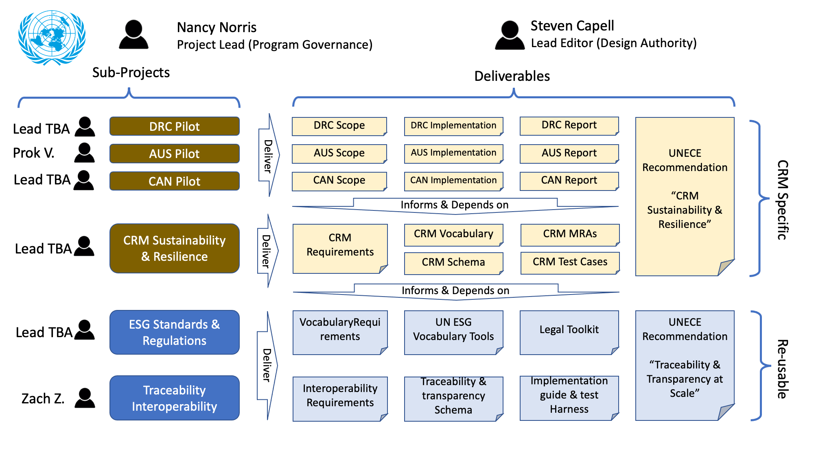

## Project Purpose

The purpose of this project is to create the trusted exchange of supply chain sustainability information between traceability platforms in a scalable, high integrity, low cost, and privacy-preserving manner.  

## Project Objectives

* We aim to facilitate and prove scalable technical interoperability (data portability). We are not creating another traceability platform nor are we planning to pick any winners.  
* We aim to scale mutual recognition of sustainability standards and jurisdictional regulations through equivalency mapping and creating (or building on existing) frameworks for determining points of convergence.   We are not defining new sustainability standards.

## Principles 

* UN/CEFACT Open Development Process is consensus-driven, collaborative, open and transparent.
* Aligned to UN SDGs (United Nations Sustainable Development Goals).
* The project will define and deliver practical, useful ways to add value. We will build real useable tools that facilitate global implementations. 
* The project will build upon related work already completed and underway by UN/CEFACT and other organizations and initiatives.

## Governance

* Project Lead (Nancy Norris): The Project Lead will coordinate the planning, implementation and monitoring of activities. The Project Lead will facilitate the implementation of the project in all its stages and provide leadership in alignment with the UN/CEFACT’s goals throughout the context of the project.
* Lead Editor (Steven Capell): The Lead Editor will collate (and edit as necessary) contributions from team members / sub-editors.  If there are conflicting opinions on a topic from the team, the lead editor will seek consensus wherever possible and make decisions as a design authority between possible options in accordance with the project goals & principles.  
* Sub-Working Group Leads: Each work stream will have an associated sub-working group with a lead. The Working group lead is responsible for organizing meetings, consolidating the working groups’ contribution to the draft deliverables, and reporting on progress to the Contributors Working Group on a bi-weekly basis.
* UN/CEFACT Bureau & Secretariat: The UN/CEFACT Bureau collectively represents the community of, the members and contributors to UN/CEFACT. It works on the development of the Centre and its recognition at the international level as the reference entity for global Trade Facilitation and Electronic Business.  The Secretariat supports the UN/CEFACT program of work.
* Heads of Delegation: Heads of Delegation represent their member States on a standing basis, as well as provide a mechanism to ensure effective public-private partnership in this UNECE programme and its monitoring by member States.

## Participant types

* Observer: Participants who are not active contributors but nevertheless want to maintain a watching brief on the UN/CEFACT project.
* Contributor: Contributors to developing the digital standards or policy recommendations that are the output of this project.
* Early Implementer: Supply chain actors or their software providers that wish to be early implementers of the standards defined by this project.

## Scope & Areas of Focus

Contributor activities have been  scoped to ensure project deliverables add value, are not duplicative and are informed (by other related projects). 

### Technology interoperability standards

* Focus: Research and develop standards for technological interoperability between global CRM (Critical Raw Materials) supply chains.  
* Expertise required: Expertise in technological interoperability between supply chains, experience building open standards and contributing to interoperability solutions (i.e. blockchain or otherwise).  Experience leading research projects related to verification, digital fingerprinting, and traceability of materials within supply chains. 

### Sustainability criteria equivalency mapping standards

* Focus: To define how sustainability information criteria will be exchanged along the supply chain, developing an understanding of equivalency across borders and unique supply chain systems. 
* Expertise required: Expertise in the development of sustainability standards, mining performance certifications, and efforts focused on improving the overall sustainability and social impact of supply chains.

### Legal/ethical considerations

* Focus: To understand legal and governance considerations related to supply chains, including audit/verification processes that are connected and recognized across multiple jurisdictions. Scope will include 
 * Legal enforcement of false claims
 * Mutual recognition of laws along the supply chain
* Expertise required: Law professionals, especially those focusing on conflict of law on free trade agreements. Professionals with experience in privacy law, information sharing agreement law, and digital information regulatory compliance security. 

### Implementation 

* Focus: As standards are developed, the implementation pilots will test them along various supply chains (copper, graphite,  lithium, cobalt).
* Expertise required: Requires technical expertise to apply and integrate specific supply chain standards developed throughout the project into solutions/technology systems.

## Working groups
The Contributors' working group consists of members who indicated their willingness to participate and have sufficient expertise. This working group will meet on a bi-weekly basis. 
Each area of focus will have an associated sub-working group, or workstream, with a lead. The leads will be selected from those who have indicated their interest using the following criteria:

* Capability (must have sufficient domain knowledge to do the job) 
* Capacity (must be able to allocate sufficient time to do the job) and 
* Neutrality (must be acceptable as independent/non-competitive to all team members) 

Workstreams will meet as needed in order to contribute meaningfully towards the development of draft deliverables. Workstream leads will report on their progress to the Contributors' working group at the bi-weekly meeting.  Workstreams (sub-groups) include:
1. Traceability Interoperability - Zachary Zeus
2. CRM Sustainability Claims Mapping - Kim Swanzey
3. Implementation Pilot - Lithium supply chain originating in Australia - Prokopiy (Prok) Vasilyev
4. Implementation Pilot - Copper supply chain originating in Canada - TBD
5. Implementation Pilot - Cobalt supply chain originating in DRC - TBD
6. Legal Analysis - Required for all workstreams - Dr. Jeanne Huang 

## Deliverables

This project will deliver a suite of materials that support government policymakers, CRM industry actors, and traceability technology providers. The blue-coloured deliverables are expected to be re-usable across other supply chain domains such as garments & footwear and agri-food. The yellow-coloured deliverables are specific to the critical raw materials domain.

Each deliverable is described on this website.

## Criteria for assessing deliverables. 

* Affordability: Affordability of the deliverable is defined as how many adopters along the supply chain can invest in and implement the recommendations without prohibitive cost. 
* Reliability: The standards and recommendations developed and implemented by this group must be reliable across different supply chain ecosystems and jurisdictions. 
* Accommodability: Deliverables are assessed on their ability to accommodate multiple supply chain solutions across jurisdictions by maintaining a technologically agnostic approach.
* Scalability: Deliverables will be assessed based on their ability to scale across multiple jurisdictions, legal frameworks, regulatory environments, and technological limitations. 
* Alignment to SDGs: Deliverables will be assessed based on their alignment with the UN SDGs.
* Privacy-preserving: Deliverables will be assessed on information security and privacy-preserving characteristics. 
* Transparency-creating: Deliverables are assessed on their ability to further transparency and trust along supply chains. 

## Criteria for assessing implementation.

The ultimate goal of this project is to facilitate the scalable uptake of digital traceability & transparency measures across the international supply chain. Delivery of standards is only a necessary milestone toward real production implementations.  Therefore, this project will only be considered successful when: 

* at least 50 different CRM supply chain actors
* using at least 5 different software platforms
* across at least 5 different value chains
* spanning at least 5 different countries
* can reveal transparent supply chain evidence for at least 10,000 consignments

This is still a tiny fraction of actual global trade volumes but is deemed sufficient to prove that the framework is scalable.

## Work plan, including activity schedules

Deliverables | Expected timeline 
-- | --
| May 2023    | Project Inception     |
| June 2023 | Call for Participation  |
| July 2023 - January 2024 | Business Requirements Research and Specification  |
| November 2023 - February 2024 | Development of the following deliverables: Draft Sustainability Vocabulary and Credential Schema, Test Suite, and Implementation Guide; Engagement with stakeholders to inform the above deliverables  |
| March 2024 - September 2024 | Pilots - Implementation and incorporation of feedback from stakeholders to refine vocabulary, schema, and test suite  |
| July 2024 | UN Policy Recommendation  |
| October - November 2024 | Public Draft Review  |
| December 2024 | Project Exit |

